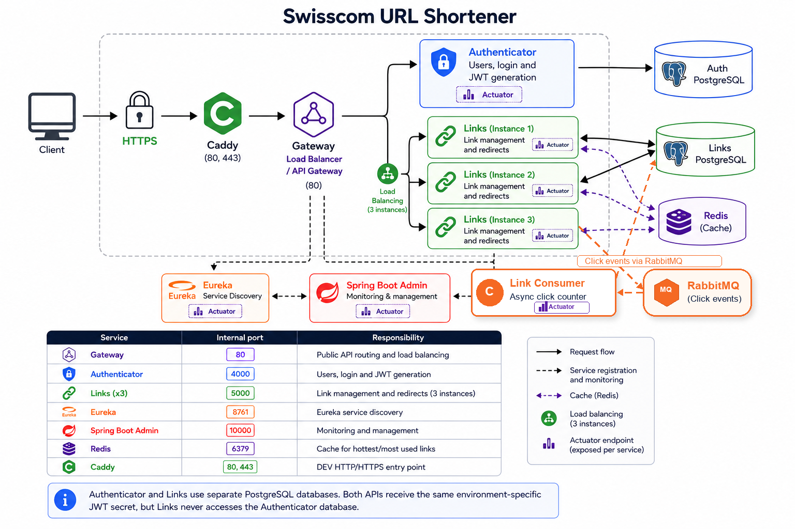

# Swisscom URL Shortener

URL shortener implemented as a Spring Boot monorepo. It includes stateless JWT
authentication, link management, service discovery, monitoring, load balancing
Redis caching, asynchronous click-count processing and HTTPS for development.

## Architecture

<p>
  
</p>


| Service | Internal port | Responsibility |
|---|---:|---|
| Gateway | `80` | Public API routing and load balancing |
| Authenticator | `4000` | Users, login and JWT generation |
| Links | `5000` | Link management and redirects |
| Link Consumer | `5100` | Asynchronous click-count updates |
| Discovery | `8761` | Eureka service discovery |
| Observability | `10000` | Spring Boot Admin |
| Redis | `6379` | Shared redirect cache used only by Links |
| RabbitMQ | `5672` | Click event broker between Links and Link Consumer |
| Caddy | `80`, `443` | DEV HTTP/HTTPS entry point |

Authenticator and Links use separate PostgreSQL databases. Both APIs receive
the same environment-specific JWT secret, but Links never accesses the
Authenticator database.

Redirects are intentionally split from click-count persistence. Links publishes
a click event to RabbitMQ after resolving a short URL, and Link Consumer updates
the Links PostgreSQL database asynchronously.

Gateway propagates `X-Correlation-Id` to Links. Links includes the value in its
MDC log context and response header; direct requests without the header receive
a generated UUID. This allows one request to be followed across the Gateway and
any of the three Links instances.

## Links cache

Only the Links service uses Redis. All three Links instances share the same
cache, which makes cached redirects available regardless of the instance
selected by the Gateway load balancer.

The `popular-links` cache stores the original URL using the short code as its
key:

```text
popular-links::{shortCode} -> originalUrl
```

The redirect flow is:

1. The first request to `GET /r/{shortCode}` looks up the active, non-expired
   link in PostgreSQL and stores its original URL in Redis.
2. Subsequent requests can resolve the destination from Redis without repeating
   that lookup.
3. Links publishes a click event to RabbitMQ after resolving the redirect.
4. Link Consumer receives that event and increments the click counter in
   PostgreSQL asynchronously.
5. Deactivating a link evicts its cache entry immediately, preventing a cached
   redirect from remaining active.

Entries have a **10-minute TTL** and null results are never cached. Links also
clears the shared `popular-links` cache on a 10-minute schedule. The
Authenticator does not depend on Redis or RabbitMQ.

## Environments

The repository intentionally supports only two execution modes:

| Environment | Applications | Data and messaging services | TLS termination |
|---|---|---|---|
| `localhost` | IntelliJ | Docker | Caddy |
| `dev` | Docker | Docker | Caddy |

Both environments use the same TLS mechanism. Caddy terminates HTTPS and keeps
its local certificate authority in the shared `swisscom-caddy-data` Docker
volume. Trusting this CA once covers both localhost and DEV.

Only one environment can run at a time because both Caddy containers publish
host port `443`. Stop the current environment before switching to the other.

## Requirements

- Java 21
- Maven 3.9+
- Docker Desktop with Docker Compose v2
- IntelliJ IDEA with Lombok annotation processing enabled
- `openssl`

Run all commands from the repository root.

## Quick start: localhost

Use this mode to run the Java applications from IntelliJ while PostgreSQL,
Redis and RabbitMQ remain in Docker.

### 1. Start databases, Redis and RabbitMQ

```bash
./deploy/run.sh localhost
```

This starts both PostgreSQL databases, Redis, RabbitMQ and Caddy. It also creates
`deploy/env/localhost/jwt-secret.env` when necessary. The file is ignored by
Git and must be loaded by both business APIs.

### 2. Configure IntelliJ

Import the root `pom.xml` as a Maven project and create these Spring Boot run
configurations:

| Order | Main class | Env files |
|---:|---|---|
| 1 | `com.swisscom.infrastructure.observability.ObservabilityApplication` | `deploy/env/localhost/observability.env` |
| 2 | `com.swisscom.infrastructure.discovery.DiscoveryApplication` | `deploy/env/localhost/discovery.env` |
| 3 | `com.swisscom.services.auth_service.AuthenticatorApplication` | `deploy/env/localhost/authenticator.env`, `deploy/env/localhost/jwt-secret.env` |
| 4 | `com.swisscom.services.links.LinksApplication` | `deploy/env/localhost/links.env`, `deploy/env/localhost/jwt-secret.env` |
| 5 | `com.swisscom.services.link_consumer.LinkConsumerApplication` | `deploy/env/localhost/link-consumer.env` |
| 6 | `com.swisscom.infrastructure.gateway.GatewayApplication` | `deploy/env/localhost/gateway.env` |

Use IntelliJ's EnvFile support. The Gateway listens on HTTP port `80`; Caddy
publishes HTTPS port `443` and forwards requests to the Gateway.

### 3. Trust Caddy once

After the localhost dependencies are running, trust the shared Caddy CA:

```bash
./deploy/trust-caddy.sh localhost
```

This is required only once. DEV reuses the same Docker volume and CA.

### 4. Open localhost services

| Service | URL |
|---|---|
| Gateway | <https://localhost> |
| Eureka | <http://localhost:8761> |
| Spring Boot Admin | <http://localhost:10000> |
| Auth Swagger | <http://localhost:4000/api/v1/auth/swagger-ui> |
| Links Swagger | <http://localhost:5000/api/v1/links/swagger-ui> |

Stop only the localhost dependencies with:

```bash
docker compose -f deploy/docker-compose.localhost.yml down
```

## Quick start: DEV

DEV runs the complete stack in Docker. Caddy is the only container publishing
host ports; application traffic remains on the internal `backend` network.

### Start everything

```bash
./deploy/run.sh dev
```

The command generates or reuses `deploy/env/dev/jwt-secret.env`, builds the
applications and starts everything in the background.

```bash
docker compose -f deploy/docker-compose.dev.yml ps
docker compose -f deploy/docker-compose.dev.yml logs -f
```

### Start one group at a time

Use this sequence when debugging startup problems:

```bash
# 1. Data and messaging layer
./deploy/run.sh dev auth-postgres links-postgres redis rabbitmq

# 2. Infrastructure
./deploy/run.sh dev observability
./deploy/run.sh dev discovery

# 3. Business APIs
./deploy/run.sh dev authenticator
./deploy/run.sh dev links
./deploy/run.sh dev link-consumer

# 4. Entry points
./deploy/run.sh dev gateway
./deploy/run.sh dev caddy
```

Compose starts declared dependencies automatically. The explicit order above
simply makes failures easier to isolate. `links` starts with the three replicas
declared in `docker-compose.dev.yml`; `link-consumer` runs as a separate worker
for click-count events.

Follow one service:

```bash
docker compose -f deploy/docker-compose.dev.yml logs -f gateway
docker compose -f deploy/docker-compose.dev.yml logs -f authenticator
docker compose -f deploy/docker-compose.dev.yml logs -f links
docker compose -f deploy/docker-compose.dev.yml logs -f link-consumer
```

### Trust Caddy when DEV is the first environment

If localhost was already configured, skip this step. Otherwise, after the DEV
`caddy` container starts, run:

```bash
./deploy/trust-caddy.sh dev
```

### Open DEV services

| Service | URL |
|---|---|
| Gateway and APIs | <https://localhost> |
| Gateway alias | <https://gateway.localhost> |
| Eureka | <https://eureka.localhost> |
| Spring Boot Admin | <https://admin.localhost> |
| Auth Swagger | <https://auth.localhost/api/v1/auth/swagger-ui> |
| Links Swagger | <https://links.localhost/api/v1/links/swagger-ui> |

Development administrator:

```text
email:    admin@swisscom.local
password: ChangeMe-Admin-2026!
```

Confirm all three Links instances:

```bash
docker compose -f deploy/docker-compose.dev.yml ps links
```

Spring Boot Admin also shows three Links instances. They share a public Swagger
service URL, while each replica registers a unique internal management URL. The
house button opens Swagger for Authenticator and Links. Internal Actuator
addresses are expected: the Admin server uses them from the Docker network and
proxies their data to its UI.

Link Consumer also appears as an internal service in Spring Boot Admin. It does
not expose public API routes; it only listens to RabbitMQ and updates click
counts.

Stop DEV without deleting data:

```bash
docker compose -f deploy/docker-compose.dev.yml down
```

## API routes

| Method | Path | Access |
|---|---|---|
| `POST` | `/api/v1/auth/login` | Public |
| `POST` | `/api/v1/auth/register` | `ADMIN` JWT |
| `GET` | `/api/v1/auth/me` | JWT |
| `POST` | `/api/v1/links` | JWT |
| `GET` | `/api/v1/links` | JWT |
| `GET` | `/api/v1/links/{id}` | JWT and ownership |
| `DELETE` | `/api/v1/links/{id}` | JWT and ownership |
| `GET` | `/r/{shortCode}` | Public |

## Tests

### Postman

Import these files into Postman:

- `postman/Swisscom URL Shortener.postman_collection.json`
- `postman/Swisscom DEV.postman_environment.json` or
  `postman/Swisscom localhost.postman_environment.json`

Select the environment and run the complete collection in its defined order.
The scripts authenticate the development admin, create a unique test user,
store both JWTs, exercise the complete link lifecycle and verify authorization
failures. Keep redirect following disabled for the public redirect requests so
Postman can assert the API's `302` response and `Location` header.

### Maven

```bash
mvn test
```

Run one module:

```bash
mvn -pl services/authenticator test
mvn -pl services/links test
mvn -pl services/link-consumer test
mvn -pl infrastructure/gateway test
```

## Troubleshooting

### Reset all DEV data

This intentionally deletes all named DEV volumes:

```bash
docker compose -f deploy/docker-compose.dev.yml down -v
```

### Rotate the shared JWT secret

```bash
docker compose -f deploy/docker-compose.dev.yml down
rm deploy/env/dev/jwt-secret.env
./deploy/run.sh dev
```

Existing tokens become invalid after rotation.
